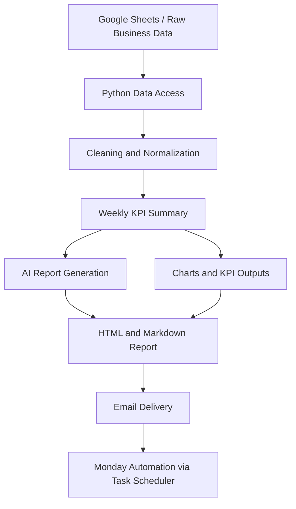
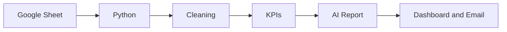

# AI Weekly Business Report Automation

An end-to-end business reporting automation project that transforms raw spreadsheet data into weekly KPIs, charts, AI-generated commentary, and an email-ready business report.

This project was built to solve a real reporting problem that many teams face: too much time is spent collecting weekly data, cleaning it, calculating metrics, preparing visuals, writing summaries, and sending updates manually. The workflow automates those repetitive steps and shows how **data analytics** and **AI automation** can work together in a practical business setting.

## Project Overview

In many organizations, weekly reporting is still handled manually. That usually means downloading data, checking quality issues, preparing KPI summaries, writing a business update, and formatting the final report for stakeholders.

This project automates that process from source data to final communication. It is designed as a project, but it addresses a real-world business need: faster reporting, more consistent metrics, and less manual effort.

## Business Problem

Weekly reporting often becomes a repetitive operational task instead of an analytical task. Analysts can lose hours each week preparing the same style of updates rather than spending time interpreting the results.

This project reduces that burden by building a repeatable reporting pipeline. Instead of manually preparing the same update every Friday, the workflow reads source data, prepares it, generates business outputs, and supports scheduled execution.

## Business Impact

This project can create value in a business environment by:

- reducing manual reporting effort
- improving consistency in KPI reporting
- speeding up weekly update generation
- helping stakeholders receive structured insights faster
- demonstrating how AI can support business communication after analytics is complete

## What This Project Does

This project automates the weekly business reporting cycle.

It:
- loads raw business data from Google Sheets
- reads from a specific spreadsheet and worksheet using a service account
- cleans and normalizes the data
- builds a weekly KPI summary
- generates an AI-written business report
- creates report outputs such as markdown and HTML
- sends the report by email
- supports one-click execution and weekly Friday scheduling through Windows Task Scheduler

## Where It Runs

This project runs locally on a machine with Python and Jupyter Notebook. It can also be scheduled to run automatically every Friday using Windows Task Scheduler.

## High-Level Workflow

At a high level, the workflow is:

1. Load raw data from Google Sheets.
2. Read the selected spreadsheet and worksheet using authenticated credentials.
3. Clean and normalize the data.
4. Build the weekly KPI summary.
5. Generate an AI business report.
6. Prepare and send the final email update.
7. Run the full workflow in one go through the main pipeline.

## Full Architecture

The project architecture can be understood in six layers:

- **Source layer** — Google Sheets and raw business data
- **Access layer** — Python-based spreadsheet connection using a service account
- **Preparation layer** — data profiling, cleaning, and normalization
- **Analytics layer** — KPI calculations and weekly summary generation
- **AI layer** — narrative generation from KPI outputs
- **Delivery layer** — HTML report creation, email sending, and Task Scheduler automation

## Workflow Diagram



## Simple Process Diagram



## Screenshots

### Weekly Dashboard


### Email Report Output


## Project Structure

```text
weekly_beauty_report_project/
├── 00_gemini_test.ipynb
├── 01_generate_synthetic_data.ipynb
├── 02_Connect_Google_Sheets.ipynb
├── 03_profile_and_clean_raw_data.ipynb
├── 04_weekly_kpi_analysis.ipynb
├── 05_llm_narrative_generation.ipynb
├── 06_send_email.ipynb
├── main_pipeline.py
├── charts.py
├── config.py
├── run_pipeline.bat
├── summary.json
├── weekly_report.md
├── weekly_report.html
├── requirements.txt
├── .gitignore
├── .env.example
├── LICENSE
├── README.md
└── assets/
    ├── dashboard.png
    └── email_report.png
```

## Tech Stack

- Python
- Jupyter Notebook
- Pandas
- Google Sheets API
- Gemini API
- HTML
- Markdown
- JSON
- Email automation
- Windows Task Scheduler

## How the Pipeline Works

### Step 1 - Load raw data from Google Sheet

The workflow begins by reading raw business data from Google Sheets.

- The project connects to a specific spreadsheet and worksheet.
- The source is accessed through authenticated credentials.
- This removes the need for manual data export each week.

**How this was done:**
- A Google service account was used for spreadsheet access.
- The spreadsheet was shared with the service account.
- Python reads the selected spreadsheet and worksheet as the reporting source.

### Step 2 - Run the main reporting workflow

The project then starts the reporting logic that prepares the weekly process.

- Python reads from the configured spreadsheet source.
- The workflow begins the reporting cycle from ingestion to output.
- This step supports repeatable weekly execution.

**How this was done:**
- The pipeline logic is organized across notebooks and Python scripts.
- Configuration controls the required source and output settings.
- The workflow is designed so that the reporting steps can be rerun each week.

### Step 3 - Clean and normalize the data

Raw data is cleaned before analysis so KPI reporting is more reliable.

- Missing values are reviewed.
- Data structure is standardized.
- Columns and formats are normalized for analysis.

**How this was done:**
- Profiling and cleaning logic was handled in the data preparation stage.
- The raw structure was reviewed before KPI calculations.
- The cleaned dataset was made analysis-ready for the weekly summary.

### Step 4 - Build the weekly summary

After preparation, the project calculates weekly KPIs and summary outputs.

- Key business metrics are computed from the cleaned data.
- The KPI output is saved in a structured form.
- This becomes the base for the AI report and dashboard.

**How this was done:**
- Python was used to calculate the KPI metrics.
- Output files such as `summary.json` store the reporting results.
- These summary outputs are reused in later pipeline stages.

### Step 5 - Generate an AI report

The KPI results are transformed into a readable business summary.

- The AI layer turns metrics into narrative reporting.
- It helps convert numbers into stakeholder-friendly business language.
- The output supports management-style communication.

**How this was done:**
- KPI outputs were passed into the narrative generation stage.
- Gemini was used to generate the weekly written report.
- The narrative was saved in markdown format for downstream use.

### Step 6 - Send an email

The final business report is prepared and shared through email.

- The report is formatted for delivery.
- The output supports business communication to stakeholders.
- This makes the reporting cycle more operationally useful.

**How this was done:**
- Local email credentials are stored through `.env`.
- The report content is prepared in an email-friendly format.
- Python sends the final output to the recipient.

### Step 7 - Run everything in one go

The full workflow can be executed as a single pipeline.

- This reduces manual effort further.
- It supports repeatable reporting.
- It also supports scheduled execution every Friday.

**How this was done:**
- `main_pipeline.py` is used as the main execution entry point.
- `run_pipeline.bat` supports one-click Windows execution.
- Windows Task Scheduler can trigger the process automatically every Friday.

## Run the Project Locally

Follow these steps to run the project on your own machine.

### 1. Clone the repository

```bash
git clone https://github.com/your-username/weekly_beauty_report_project.git
```

### 2. Move into the project folder

```bash
cd weekly_beauty_report_project
```

### 3. Create a virtual environment

A virtual environment keeps the project dependencies separate from other Python projects.

```bash
python -m venv .venv
```

### 4. Activate the virtual environment

On Windows:

```bash
.venv\Scripts\activate
```

On Mac/Linux:

```bash
source .venv/bin/activate
```

### 5. Install dependencies

```bash
pip install -r requirements.txt
```

### 6. Create a local `.env` file

Create a file named `.env` in the root folder and add your local values.

```text
GMAIL_SENDER=your_email@gmail.com
GMAIL_APP_PASSWORD=your_app_password
REPORT_RECIPIENT=recipient_email@gmail.com
GEMINI_API_KEY=your_gemini_api_key
GEMINI_MODEL=gemini-pro
```

### 7. Add Google credentials

Place your local `service_account.json` file in the root folder.

### 8. Run the notebooks in order

```text
02_Connect_Google_Sheets.ipynb
03_profile_and_clean_raw_data.ipynb
04_weekly_kpi_analysis.ipynb
05_llm_narrative_generation.ipynb
06_send_email.ipynb
```

### 9. Run the main pipeline

```bash
python main_pipeline.py
```

### 10. Optional one-click run on Windows

```text
run_pipeline.bat
```

## Outputs

The project can generate:

- `summary.json`
- `weekly_report.md`
- `weekly_report.html`
- KPI charts and visuals
- email-ready report output

## Future Improvements

Possible future improvements include:

- database integration instead of spreadsheet-only input
- more advanced KPI anomaly detection
- PDF export support
- richer interactive dashboard features
- stronger logging and monitoring
- multi-team or multi-department reporting support
- cloud deployment for scheduled execution beyond a local machine

## Privacy and Security

Sensitive files such as `.env` and `service_account.json` should never be uploaded to GitHub. Use `.env.example` to show the required variables safely.

## License

This project is licensed under the MIT License. See the `LICENSE` file for details.
